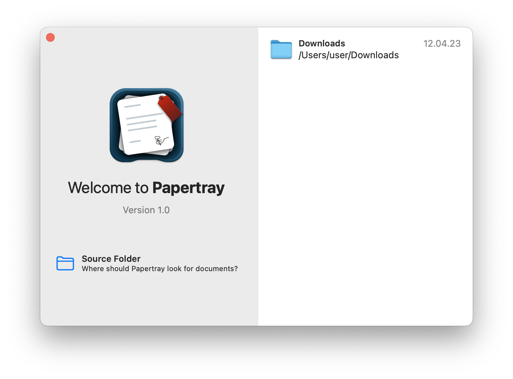

# LauncherWindow


LauncherWindow adds a new window scenes to SwiftUI. Launcher windows are
[frameless windows] that display a welcome message and let the user choose
an item from a list i.e. a database or a folder from many recent ones.

[frameless windows]: /astzweig/swiftui-frameless-window#framelesswindow

> [!NOTE]
> By default a launcher window is non resizable. If you want it to be resizable use the `.windowResizability` view modifier.

## Usage
Create a launcher window:

```swift
import SwiftUI
import LauncherWindow

@main
struct YourApp: App {
    var body: some Scene {
        LauncherWindow(withId: "launcher") {
            ActionItemsView()
        } listItems: {
            ListItemsView()
        }
    }
}
```

## Documentation
The library has enriched symbol documentation for [DocC].

[DocC]: https://www.swift.org/documentation/docc/documenting-a-swift-framework-or-package

## Testing `LauncherWindow`
LauncherWindow includes an executable target that launches a SwiftUI app to
test `LauncherWindow`. Either execute it with

```sh
$ swift run
```

or select the `LauncherWindowTestApp` under `Product > Scheme` in Xcode.

## Adding `LauncherWindow` as a Dependency

To use the `LauncherWindow` library in a SwiftUI project, 
add it to the dependencies for your package:

```swift
let package = Package(
    // name, platforms, products, etc.
    dependencies: [
        // other dependencies
        .package(url: "https://github.com/astzweig/swiftui-launcher-window", from: "1.0.0"),
    ],
    targets: [
        .executableTarget(name: "<command-line-tool>", dependencies: [
            // other dependencies
            .product(name: "LauncherWindow", package: "swiftui-launcher-window"),
        ]),
        // other targets
    ]
)
```

### Supported Versions

The minimum Swift version supported by swiftui-launcher-window releases are detailed below:

swiftui-launcher-window   | Minimum Swift Version
---------------------------|----------------------
`0.0.1 ...`                | 5.7
